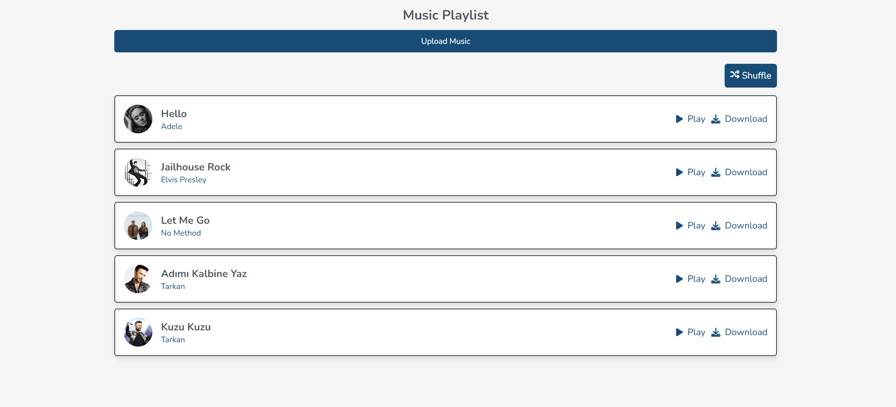
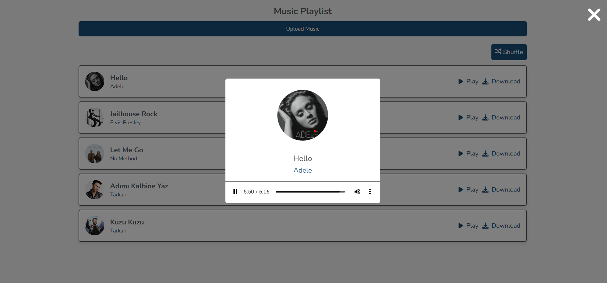
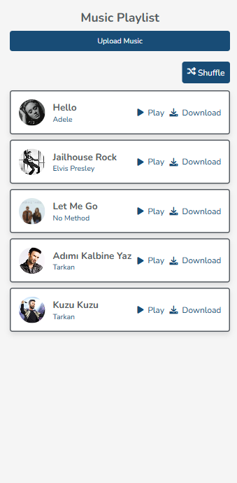
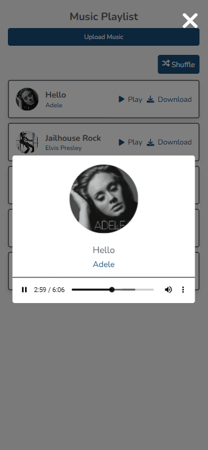

# Music Player Project

This project is a simple music player application that allows users to listen to music. It includes features such as playing songs in order, shuffling songs, and displaying song details like name, artist, and album.

## Features

- **Play in Order**: Songs are played sequentially.
- **Shuffle Mode**: Songs are played randomly (shuffle).
- **Song Details**: Displays the name, artist, and album of each song.
- **Close Button**: The music player can be closed at any time.

## Images

<div style="display: flex; justify-content: space-around; gap: 10px;">
  
  
  
  
</div>

## Technologies Used

- HTML5
- CSS3
- JavaScript (Vanilla)
- [Font Awesome](https://fontawesome.com/) (For icons)

## How to Use

1. Clone the repository or download the project:

    ```bash
    git clone https://github.com/Asliikl/music-playlist.git
    ```

2. Open the `home.php` file in your browser.

## Project Structure


